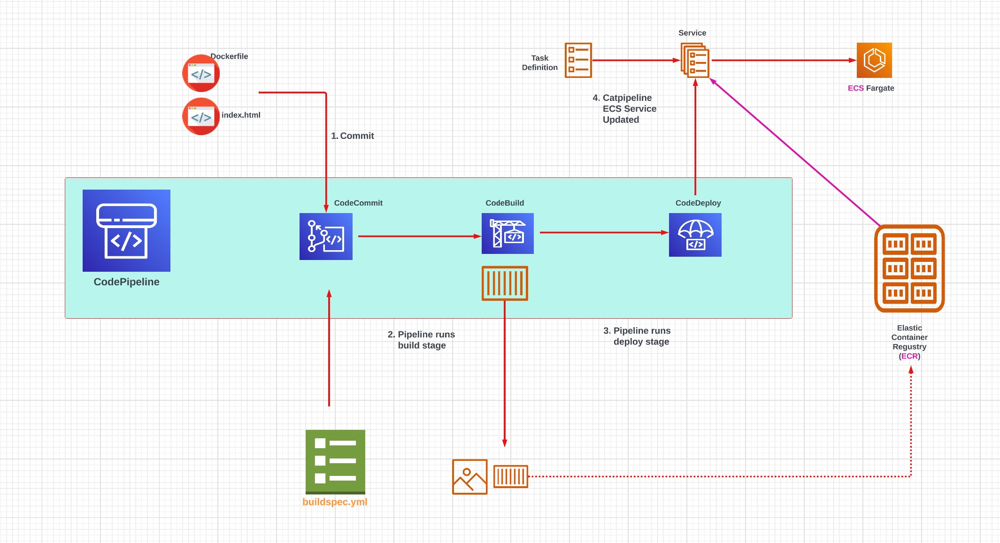

# Week 0 — Billing and Architecture

## Required Homework

### Recreate Conceptual Diagram in Lucid Charts or on a Napkin
I drew my conceptual diagram for the cruddur application as shown below: 

### Recreate Cat Pipeline
I created my Catpipeline diagram using lucid charts and can be found here [Catpipeline diagram link](https://lucid.app/lucidchart/755be43d-2f6e-42ea-a518-9829d2c4cfc2/edit?viewport_loc=-1109%2C-609%2C4156%2C1997%2C0_0&invitationId=inv_cc83c96f-41cd-441d-81e3-e285811a5f9f) and shown below 

### AWS CLI 
I installed AWS CLI which can be found in my [gitpod.yml file](https://github.com/kayboy-007/aws-bootcamp-cruddur-2023/blob/main/.gitpod.yml)

### Create a Budget
I created two budgets as shown below:

### Create an Alarm
The alarm I created can be found in my repository [Alarm config file](https://github.com/kayboy-007/aws-bootcamp-cruddur-2023/blob/main/aws/json/alarm-config.json)

## Homework Challenges
